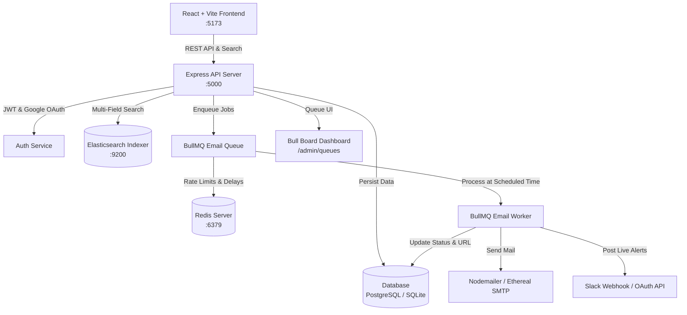

# 🚀 ReachInbox — Email Outreach & Automated Scheduling Platform

[](https://www.typescriptlang.org/)
[](https://reactjs.org/)
[](https://tailwindcss.com/)
[](https://bullmq.io/)
[](https://redis.io/)
[](https://www.elastic.co/)
[](https://nodemailer.com/)

A modern, high-performance **Email Outreach & Campaign Scheduling Platform** built with **React, TypeScript, Express, BullMQ, Redis, PostgreSQL/SQLite, Elasticsearch, Ethereal SMTP, and Slack OAuth**.

The user interface reproduces the clean, minimal, high-density visual design from the **ReachInbox Figma design**, featuring compact data tables, interactive recipient chips, CSV/TXT lead ingestion, rich-text email composition, Redis rate-limiting controls, live search, and a built-in Bull Board queue inspector.

---

## 📑 Table of Contents
1. [Key Features](#-key-features)
2. [Visual Design & Figma Alignment](#-visual-design--figma-alignment)
3. [System Architecture](#-system-architecture)
4. [Tech Stack](#-tech-stack)
5. [Project Structure](#-project-structure)
6. [Quick Start Guide](#-quick-start-guide)
7. [API Reference](#-api-reference)
8. [Configuration & Environment Variables](#-configuration--environment-variables)
9. [Queue & Worker Engine](#-queue--worker-engine)

---

## ✨ Key Features

- 🔐 **Real Google OAuth & Credentials Auth**: Supports Google OAuth 2.0 verification and standard email/password authentication with JWT sessions.
- ⚡ **BullMQ & Redis Background Queuing**: Distributed job queues for scheduled email dispatch with customizable start times and delay spacing.
- ⏱️ **Configurable Spacing Delay (`EMAIL_SEND_DELAY_MS`)**: Enforces delays between consecutive emails to preserve sender reputation.
- 🛡️ **Redis Token-Bucket Hourly Rate Limiter**: Server-side hourly rate limiting to safeguard sending quotas.
- 🔍 **Elasticsearch Multi-Field Search (`/api/emails/search`)**: Fast fuzzy search across `recipient`, `subject`, `body`, and `sender` scoped to the authenticated user.
- ✉️ **Ethereal SMTP Integration**: Delivers test emails with live preview URLs (`https://ethereal.email/message/...`) viewable directly in the browser.
- 💬 **Slack OAuth & Live Notifications**: Real-time Slack notifications when email campaigns are scheduled or successfully delivered.
- 📊 **Embedded Bull Board Dashboard**: Real-time queue visualizer mounted at `/admin/queues`.
- 📁 **CSV & TXT Lead Ingestion**: Drag-and-drop file upload that detects email addresses, removes duplicates, and displays validation metrics.
- ✍️ **Rich Text Email Composer**: Lightweight editor toolbar with bold, italic, underline, lists, alignment, links, and undo/redo.

---

## 🎨 Visual Design & Figma Alignment

| Component | Figma Design Implementation |
|---|---|
| **Color Palette** | Main light background (`#FAFAFA`), subtle gray borders (`#E5E7EB`), Emerald Green primary accent (`#10B981` / `#059669`). |
| **Login Screen** | Centered compact card with subtle pink/magenta outline accent (`ring-1 ring-pink-300`), Google OAuth button, and fast 1-click Demo credentials. |
| **Header** | Clean SaaS header with brand logo, global Elasticsearch search field, Bull Board link, and user profile avatar with dropdown. |
| **Sidebar** | Compact left navigation with `Scheduled` count badge, `Sent` count badge, `+ Compose New Email` CTA, and a `Slack Integration` card. |
| **Tables** | High-density data tables with compact rows, subtle hover states, status pills (`Scheduled`, `Sending`, `Sent`, `Failed`), and Ethereal preview links. |
| **Composer** | From selector, interactive recipient chips (`john@example.com ×`, `+4`), CSV/TXT upload strip, start time picker, delay input, hourly limit input, rich text editor, and green schedule CTA. |

---

## 🏗️ System Architecture



---

## 💻 Tech Stack

### Frontend
- **Framework**: React 18 (Vite, TypeScript)
- **Styling**: Tailwind CSS (custom Figma tokens)
- **Icons**: Lucide React
- **Routing**: React Router DOM v6
- **HTTP Client**: Axios

### Backend
- **Runtime**: Node.js (TypeScript, Express)
- **Queues**: BullMQ
- **In-Memory Store**: Redis (`ioredis`)
- **Database**: SQLite (`better-sqlite3`) / PostgreSQL schema
- **Search**: Elasticsearch (`@elastic/elasticsearch`)
- **Mailing**: Nodemailer (with Ethereal SMTP test accounts)
- **Integrations**: Slack SDK (`@slack/web-api`), Google Auth Library (`OAuth2Client`)
- **Monitoring**: Bull Board (`@bull-board/express`)

---

## 📂 Project Structure

```
reachinbox/
├── start-all.bat               # 1-Click Windows batch launcher
├── start-all.ps1               # 1-Click PowerShell launcher
├── README.md                   # Documentation
│
├── backend/                    # Express + BullMQ Backend
│   ├── src/
│   │   ├── config/
│   │   │   ├── database.ts     # Schema & persistent database connection
│   │   │   ├── redis.ts        # Redis client & BullMQ connection options
│   │   │   └── elasticsearch.ts# Elasticsearch indexer & multi-field search
│   │   ├── middleware/
│   │   │   └── auth.ts         # JWT token authentication middleware
│   │   ├── routes/
│   │   │   ├── authRoutes.ts   # Login, Register, Google OAuth, Me
│   │   │   ├── emailRoutes.ts  # Schedule, Scheduled, Sent, Search, Upload
│   │   │   ├── slackRoutes.ts  # Slack OAuth & Live Notifications
│   │   │   └── senderRoutes.ts # Sender profiles management
│   │   ├── services/
│   │   │   ├── authService.ts  # Password hashing & Google verification
│   │   │   ├── queueService.ts # BullMQ queue definition & job enqueuing
│   │   │   ├── emailService.ts # Nodemailer + Ethereal transporter
│   │   │   ├── rateLimiter.ts  # Redis token bucket hourly rate limiter
│   │   │   └── slackService.ts # Slack OAuth client & alert dispatcher
│   │   ├── workers/
│   │   │   └── emailWorker.ts  # BullMQ worker enforcing rate limits & delays
│   │   └── server.ts           # Main Express server & Bull Board mount
│   ├── package.json
│   └── tsconfig.json
│
└── frontend/                   # React + Vite Frontend
    ├── src/
    │   ├── components/
    │   │   ├── Header.tsx          # Top header with search & profile
    │   │   ├── Sidebar.tsx         # Left navigation & Slack card
    │   │   ├── RichTextEditor.tsx  # Rich text formatting toolbar & canvas
    │   │   └── EmailDetailModal.tsx# Email inspection modal
    │   ├── context/
    │   │   └── AuthContext.tsx     # Global authentication provider
    │   ├── pages/
    │   │   ├── Login.tsx           # Figma login card with Google OAuth
    │   │   ├── ScheduledEmails.tsx # Scheduled emails data table
    │   │   ├── SentEmails.tsx      # Sent emails data table with preview URLs
    │   │   └── ComposeEmail.tsx    # Email composer with chips & CSV upload
    │   ├── services/
    │   │   └── api.ts              # Axios client with auth interceptor
    │   ├── types/
    │   │   └── index.ts            # TypeScript interfaces
    │   ├── App.tsx                 # Main routing & state polling
    │   ├── main.tsx                # React entry point
    │   └── index.css               # Tailwind CSS directives
    ├── package.json
    ├── vite.config.ts
    └── tailwind.config.js
```

---

## ⚡ Quick Start Guide

### Option 1: One-Click Launch (Windows)
Double-click `start-all.bat` or run:
```powershell
.\start-all.ps1
```
This automatically launches **Redis**, the **Backend API & BullMQ Worker**, and the **Frontend Dev Server**.

---

### Option 2: Manual Setup

#### 1. Start Redis Server
```bash
# In redis directory:
redis-server.exe
```

#### 2. Start Backend Server
```bash
cd backend
npm install
npm run build
npm start
# Server runs at http://localhost:5000
# Bull Board available at http://localhost:5000/admin/queues
```

#### 3. Start Frontend UI
```bash
cd frontend
npm install
npm run dev
# Frontend runs at http://localhost:5173
```

---

## 🔗 API Reference

### Authentication (`/api/auth`)
| Method | Endpoint | Description |
|---|---|---|
| `POST` | `/api/auth/register` | Register a new user account |
| `POST` | `/api/auth/login` | Email & password login (returns JWT) |
| `POST` | `/api/auth/google` | Google OAuth token verification |
| `GET`  | `/api/auth/me` | Fetch authenticated user profile |
| `POST` | `/api/auth/logout` | Invalidate user session |

### Emails & Scheduling (`/api/emails`)
| Method | Endpoint | Description |
|---|---|---|
| `POST` | `/api/emails/schedule` | Schedule an email campaign with delays and rate limits |
| `GET`  | `/api/emails/scheduled` | List pending & sending emails for user |
| `GET`  | `/api/emails/sent` | List sent & failed emails with preview URLs |
| `GET`  | `/api/emails/search?q=:query` | Elasticsearch multi-field search across emails |
| `GET`  | `/api/emails/:id` | Get single email details |
| `POST` | `/api/emails/:id/cancel` | Cancel scheduled email and remove from BullMQ |
| `POST` | `/api/emails/upload-csv` | Parse CSV/TXT file and extract deduplicated emails |

### Slack Integration (`/api/slack`)
| Method | Endpoint | Description |
|---|---|---|
| `GET`  | `/api/slack/authorize` | Get Slack OAuth authorize URL |
| `GET`  | `/api/slack/callback` | OAuth redirect callback handler |
| `GET`  | `/api/slack/status` | Check if Slack is connected |
| `POST` | `/api/slack/disconnect` | Disconnect Slack integration |

---

## ⚙️ Configuration & Environment Variables

### Backend `.env` Options
```env
PORT=5000
JWT_SECRET=reachinbox-super-secret-jwt-key-2024
REDIS_HOST=127.0.0.1
REDIS_PORT=6379
ELASTICSEARCH_NODE=http://localhost:9200
GOOGLE_CLIENT_ID=your-google-client-id.apps.googleusercontent.com
SLACK_CLIENT_ID=your-slack-client-id
SLACK_CLIENT_SECRET=your-slack-client-secret
SLACK_REDIRECT_URI=http://localhost:5000/api/slack/callback
```

---

## 🚦 Queue & Worker Engine

1. **Job Scheduling**: When `POST /api/emails/schedule` is called, jobs are added to BullMQ with a calculated delay `(startTime - now) + (index * delayMs)`.
2. **Rate Limiting Check**: Before delivery, the worker checks Redis key `ratelimit:{userId}:{hour}` against `hourlyLimit`. If exhausted, the job automatically reschedules to the next hour.
3. **Delay Spacing**: The worker ensures a minimum `EMAIL_SEND_DELAY_MS` delay between emails sent by the same account.
4. **Delivery & Live Preview**: Sends via Nodemailer Ethereal SMTP and records `preview_url` (e.g. `https://ethereal.email/message/...`).
5. **Live Notifications**: Emits structured notifications to Slack and updates the Elasticsearch index in real time.

---

## 📄 License
MIT License. Built for ReachInbox Engineering Assessment.