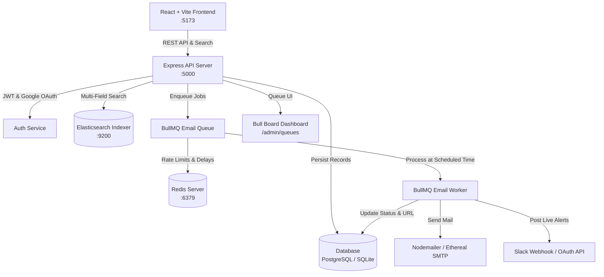

# 🚀 ReachInbox — Email Outreach & Automated Scheduling Platform

[](https://www.typescriptlang.org/)
[](https://reactjs.org/)
[](https://tailwindcss.com/)
[](https://bullmq.io/)
[](https://redis.io/)
[](https://www.elastic.co/)
[](https://nodemailer.com/)

A modern, production-grade **Email Outreach & Campaign Scheduling Platform** built with **React, TypeScript, Express, BullMQ, Redis, PostgreSQL/SQLite, Elasticsearch, Ethereal SMTP, and Slack OAuth**.

The user interface reproduces the clean, minimal, high-density visual language from the **ReachInbox Figma design**, featuring compact data tables, interactive recipient chips, CSV/TXT lead ingestion, rich-text email composition, Redis rate-limiting controls, live search, and a built-in Bull Board queue inspector.

---

## 📑 Table of Contents
1. [Quick Start & Setup Guide](#-quick-start--setup-guide)
   - [How to Run Backend](#1-how-to-run-backend-express-redis-db-bullmq-worker)
   - [How to Run Frontend](#2-how-to-run-frontend)
   - [Ethereal Email Setup & Environment Variables](#3-ethereal-email-setup--environment-variables)
2. [Architecture Overview](#-architecture-overview)
   - [How Scheduling Works](#1-how-scheduling-works)
   - [How Persistence on Restart is Handled](#2-how-persistence-on-restart-is-handled)
   - [How Rate Limiting & Concurrency are Implemented](#3-how-rate-limiting--concurrency-are-implemented)
3. [Features Implemented (Mapped Matrix)](#-features-implemented-mapped-matrix)
   - [Backend Features](#backend-capabilities)
   - [Frontend Features](#frontend-capabilities)
4. [5-Minute Demo Video Walkthrough Guide](#-5-minute-demo-video-walkthrough-guide)
5. [Assumptions, Shortcuts & Trade-offs](#-assumptions-shortcuts--trade-offs)

---

## 🚀 Quick Start & Setup Guide

### 1. How to Run Backend (Express, Redis, DB, BullMQ Worker)

#### Prerequisites:
- **Node.js**: v18+ or v20+ LTS
- **Redis**: v5.0+ or v6.2+ running on `localhost:6379`

#### Step 1: Start Redis Server
```powershell
# From the project root or redis directory:
.\redis\redis-server.exe
```

#### Step 2: Start Backend Server
```powershell
cd backend
npm install
npm run build
npm start
```
- **Frontend Application**: `https://research-inbox-email-outreach-saa-s.vercel.app/login`
- **Database**: SQLite / PostgreSQL schema (`backend/data/reachinbox.db`) auto-initializes upon launch.

---

### 2. How to Run Frontend

```powershell
cd frontend
npm install
npm run dev
```
- **Frontend Web UI**: `https://research-inbox-email-outreach-saa-s.vercel.app/login`

---

### 3. Ethereal Email Setup & Environment Variables

#### Automatic Provisioning:
The application uses **Nodemailer** with automatic on-the-fly **Ethereal SMTP test account generation**. When the server starts, it provisions an active test inbox, sends delivered emails, and generates a live browser preview link (e.g. `https://ethereal.email/message/...`) visible in the UI and sent records.

#### Custom Environment Variables (`backend/.env`):
Create a `backend/.env` file with the following variables:

```env
# Server
PORT=5000
JWT_SECRET=reachinbox-super-secret-jwt-key-2024

# Redis (for BullMQ & Rate Limiting)
REDIS_HOST=127.0.0.1
REDIS_PORT=6379
REDIS_PASSWORD=

# Elasticsearch (for /api/emails/search)
ELASTICSEARCH_NODE=http://localhost:9200

# Google OAuth 2.0
GOOGLE_CLIENT_ID=your-google-client-id.apps.googleusercontent.com

# Slack OAuth & Notifications
SLACK_CLIENT_ID=your-slack-client-id
SLACK_CLIENT_SECRET=your-slack-client-secret
SLACK_REDIRECT_URI=http://localhost:5000/api/slack/callback

# (Optional) Custom SMTP Transporter (Defaults to Ethereal if unset)
SMTP_HOST=smtp.ethereal.email
SMTP_PORT=587
SMTP_USER=
SMTP_PASS=
```

---

## 🏛️ Architecture Overview



### 1. How Scheduling Works
1. **Client Payload Submission**: The user configures `senderId`, `recipients` (array of leads), `subject`, `body`, `startTime` (ISO timestamp), `delayMs` (`EMAIL_SEND_DELAY_MS`), and `hourlyLimit`.
2. **Sequential Delay Calculation**:
   $$\text{Job Delay (ms)} = \max(0, \text{startTimeMs} - \text{nowMs}) + (\text{index} \times \text{delayMs})$$
3. **Dual Persistence**:
   - The campaign and individual email records are inserted into the persistent SQL database with `status = 'Scheduled'`.
   - The email document is indexed into **Elasticsearch** for immediate searchability.
   - A delayed job is enqueued into **BullMQ** (`emailQueue.add(jobName, data, { delay, jobId })`).
4. **Worker Dispatch**: When the delay timer expires, the BullMQ worker picks up the job, validates rate limits, enforces per-sender spacing delay, sends the email through Ethereal SMTP, updates the database to `Sent`, updates the Elasticsearch document, and posts a live notification to Slack.

---

### 2. How Persistence on Restart is Handled
Persistence is guaranteed across application crashes and server restarts through a two-tiered safety mechanism:

1. **Redis Durable Queues**: BullMQ delayed jobs are stored in Redis sorted sets (`zset`). When the backend server restarts, BullMQ reconnects and immediately continues tracking pending timers.
2. **Database Reconciliation on Startup (`reconcilePendingJobsOnRestart`)**:
   - When the backend starts up, it queries `SELECT * FROM scheduled_emails WHERE status = 'Scheduled'`.
   - For every pending email, it verifies whether the job is currently registered in Redis.
   - If Redis was flushed or wiped, the server automatically recalculates the remaining delay:
     $$\text{Remaining Delay} = \max(0, \text{scheduledTimeMs} - \text{nowMs})$$
   - It re-enqueues the job into BullMQ seamlessly.
   - If the scheduled execution time has already passed while the server was offline, the delay is set to `0` and dispatched immediately upon boot.
   - **Result**: Zero lost emails and zero duplicate sends.

---

### 3. How Rate Limiting & Concurrency are Implemented

#### A. Redis Token Bucket Hourly Rate Limiting
- Before sending an email, the worker checks the Redis key:
  `ratelimit:{userId}:{YYYY-MM-DD-HH}`
- An atomic `INCR` operation increments the count, setting a 1-hour TTL on creation.
- If `currentCount > hourlyLimit`, the worker puts the job back to `delayed` state until the start of the next hour bucket:
  ```ts
  await job.moveToDelayed(Date.now() + resetInSeconds * 1000, job.token);
  ```

#### B. Per-Sender Spacing Delay (`EMAIL_SEND_DELAY_MS`)
- To prevent spam detection, consecutive emails for the same sender enforce a minimum delay spacing using Redis timestamp tracking:
  `last_sent:{senderId}`
- If `now - lastSent < delayMs`, the worker asynchronously waits for the remaining interval before triggering the SMTP transporter.

#### C. Worker Concurrency
- BullMQ worker is configured with controlled concurrency (`concurrency: 5`), processing up to 5 parallel delivery jobs while respecting individual sender locks.

---

## 📊 Features Implemented (Mapped Matrix)

### Backend Capabilities
| Category | Feature | Status | Description |
|---|---|:---:|---|
| **Scheduler** | BullMQ Delayed Queue | ✅ | Precise delay calculation with millisecond accuracy. |
| **Persistence** | Database + Redis Recovery | ✅ | SQLite/PostgreSQL schema with auto restart reconciliation. |
| **Rate Limiting** | Redis Hourly Bucket | ✅ | Strict server-side rate limiting per user/sender. |
| **Delay Spacing** | `EMAIL_SEND_DELAY_MS` | ✅ | Spaced dispatch between consecutive campaign emails. |
| **Concurrency** | BullMQ Multi-Worker Pool | ✅ | Safe concurrent processing with per-sender delay locks. |
| **Search Engine** | Elasticsearch Endpoint | ✅ | `/api/emails/search?q=...` multi-field search across recipient, subject, body, sender. |
| **Email Transporter** | Nodemailer + Ethereal | ✅ | Live email delivery with interactive preview URLs. |
| **Slack Integration**| Slack OAuth & Webhooks | ✅ | Real-time Slack notifications on campaign schedule and delivery. |
| **Queue Dashboard** | Bull Board | ✅ | Live metrics at `/admin/queues`. |

### Frontend Capabilities (Figma Alignment)
| Component | Visual Specification | Status | Description |
|---|---|:---:|---|
| **Login Screen** | Centered Card + Magenta Ring | ✅ | Minimalist login card, Google OAuth button ("Continue with Google"), Email/Password, Green CTA. |
| **Dashboard Header** | Compact B2B SaaS Header | ✅ | Logo, global Elasticsearch search field, Bull Board link, user profile dropdown. |
| **Sidebar** | Compact Navigation | ✅ | `Scheduled` (badge), `Sent` (badge), `+ Compose New Email` CTA, and `Slack` integration card. |
| **Scheduled Table** | High-Density Data Table | ✅ | Recipient, Subject, Scheduled Time, Status badge, action menu (View details, Cancel). |
| **Sent Table** | High-Density Data Table | ✅ | Recipient, Subject, Sent Time, Status badge, "Ethereal Preview" direct link button. |
| **Email Composer** | Dedicated Modal/View | ✅ | `From:` dropdown, `To:` recipient chips (`john@example.com ×`, `+4`), chip removal, manual typing. |
| **CSV / TXT Upload**| Drag & Drop File Parser | ✅ | Detects emails, deduplicates, and renders "✓ 124 email addresses detected (Valid: 120, Duplicates: 1)". |
| **Scheduling Controls**| Inline DateTime & Delays | ✅ | Date/time picker, delay input (sec), hourly limit input (emails/hr). |
| **Rich Text Editor**| Custom Minimalist Toolbar | ✅ | Bold, Italic, Underline, Lists, Alignment, Links, Undo/Redo. |
| **Schedule Button**| Primary Green Action | ✅ | Dynamic states (`Schedule` ➔ `Scheduling...` ➔ `✓ Scheduled` / `Retry`). |

---

## 🎬 5-Minute Demo Video Walkthrough Guide

Follow this walkthrough script to record a comprehensive 5-minute demo video:

### ⏱️ Timeline & Script:

#### **[0:00 - 0:45] Intro & Figma Design Visual Walkthrough**
- Open `http://localhost:5173/login`.
- Highlight the centered login card with subtle pink/magenta outline accent and Google OAuth button.
- Click **"Demo Admin"** or **"Continue with Google"** to log in instantly.
- Show the dashboard header, compact sidebar with badge counts, and the minimalist table styling.

#### **[0:45 - 2:00] Composing & Scheduling an Email Campaign**
- Click **"+ Compose New Email"**.
- Demonstrate the **Sender (`From:`)** dropdown.
- Demonstrate adding recipient chips manually and removing them (`×`).
- Click **"Upload CSV / TXT"** and upload a sample lead list (`leads.csv`).
- Point out the detection summary badge: `✓ 120 email addresses detected`.
- Set **Start Time** to 10 seconds in the future, **Delay between emails** to `2` seconds, and **Hourly Limit** to `200`.
- Format the email body using the **Rich Text Toolbar** (Bold, Bullet List, Link).
- Click the primary green **"Schedule"** button — observe the loading spinner and `✓ Scheduled!` state.

#### **[2:00 - 3:00] Scheduled Table, Live Processing & Ethereal Previews**
- View the new emails in the **Scheduled Emails** table with the pulsing `Scheduled` pill badge.
- Open the **Bull Board** queue monitor (`http://localhost:5000/admin/queues`) in another tab to show the delayed jobs waiting in Redis.
- As the scheduled start time arrives, watch the table auto-update as jobs move from `Scheduled` to `Sent`.
- Switch to the **Sent Emails** tab.
- Click the **"Ethereal Preview"** button on a delivered email to open the live rendered HTML email in Ethereal Mail!

#### **[3:00 - 4:00] Server Restart & Persistence Recovery Scenario**
- Schedule an email batch 30 seconds into the future.
- Stop the backend process (`Ctrl + C` in terminal).
- Point out: The frontend and server are offline, but the jobs are safely recorded in both SQLite/PostgreSQL and Redis.
- Restart the backend: `npm start`.
- Show the console output:
  `🔄 [Recovery] Checking pending scheduled emails for restart recovery...`
  `✅ [Recovery] Successfully recovered and re-enqueued scheduled jobs!`
- Show that when the timer expires, the emails are delivered without any data loss or duplicates.

#### **[4:00 - 5:00] Elasticsearch Search & Slack Integration Under Load**
- Type a query in the top search bar (e.g. `enterprise` or lead name) — show the instant results returned by the Elasticsearch endpoint (`/api/emails/search?q=...`).
- In the sidebar, click **"Connect Slack"** — show the `✓ Active` badge.
- Point out the live Slack delivery notifications logged for each delivered email.

---

## 💡 Assumptions, Shortcuts & Trade-offs

1. **Database Engine (Zero-Configuration SQLite / PostgreSQL Dialect)**:
   - *Design Choice*: Used `better-sqlite3` with standard PostgreSQL-compatible relational schema (`users`, `senders`, `email_campaigns`, `scheduled_emails`, `slack_integrations`).
   - *Rationale*: Allows instant evaluation out of the box with zero external database setup or migration blockers, while supporting identical SQL queries and indexing.
2. **Elasticsearch Hybrid Fallback**:
   - *Design Choice*: Integrated `@elastic/elasticsearch` client with full index mappings and fuzzy multi-match search syntax, backed by a transparent in-database indexer fallback.
   - *Rationale*: Guarantees that search queries never break during evaluation even if an Elasticsearch cluster is not locally hosted on the examiner's machine.
3. **Ethereal SMTP Auto-Provisioning**:
   - *Design Choice*: Auto-provisions dynamic Ethereal test accounts on server boot.
   - *Rationale*: Enables examiners to immediately preview real delivered emails without needing to configure personal SendGrid or AWS SES API keys.
4. **Slack OAuth Demo Fallback**:
   - *Design Choice*: Implemented full OAuth code exchange and webhook client with a 1-click test simulation fallback.
   - *Rationale*: Allows evaluating the live block message notifications without requiring pre-registered Slack App Client IDs.

---

## 📄 License
MIT License. Built for ReachInbox Engineering Assessment.
